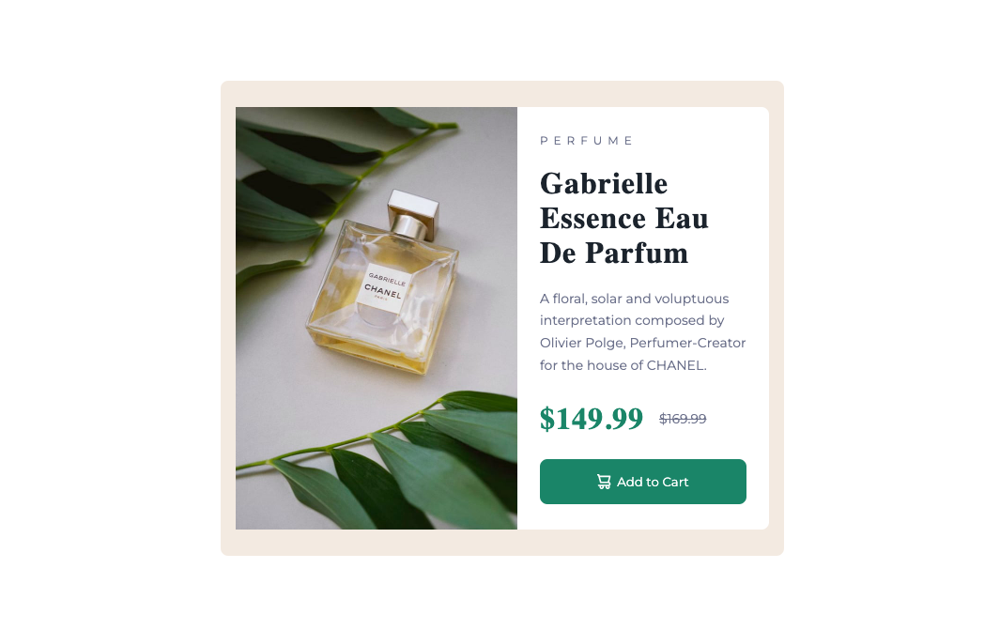

# Frontend Mentor - Product preview card component solution

This is a solution to the [Product preview card component challenge on Frontend Mentor](https://www.frontendmentor.io/challenges/product-preview-card-component-GO7UmttRfa). 

## Table of contents

- [Overview](#overview)
  - [Requirements](#requirements)
  - [Screenshot](#screenshot)
  - [Links](#links)
- [My process](#my-process)
  - [Built with](#built-with)
  - [What I learned](#what-i-learned)
  - [Continued development](#continued-development)
- [Author](#author)

## Overview

### Requirements

Users should be able to:

- View the optimal layout depending on their device's screen size
- See hover and focus states for interactive elements

### Screenshot

### Links

- Solution URL: [Add solution URL here](https://github.com/jacksonwhiting/product-preview-card-component-main)
- Live Site URL: [Add live site URL here](https://product-card-component-jwhiting.netlify.app/)

## My process

### Built with

- CSS
- Flexbox
- Mobile-first workflow

### What I learned

The goal of this product was to build a simple product card component using HTML and CSS (no frameworks or libraries).  

I had to re-learn flexbox and used it for the layout.  It was so fun to get back into coding and build something from scratch.  Looking forward to the next project!

### Continued development

As I move into larger projects I'd like to learn how to incorporate CSS grid with Flexbox for optimal layouts.

Additionally, I'll be working on responsive images and a more responsive design.

## Author

- Frontend Mentor - [@jacksonwhiting](https://www.frontendmentor.io/profile/jacksonwhiting)
- Twitter - [@JWhiting00](https://www.twitter.com/jwhiting00)

